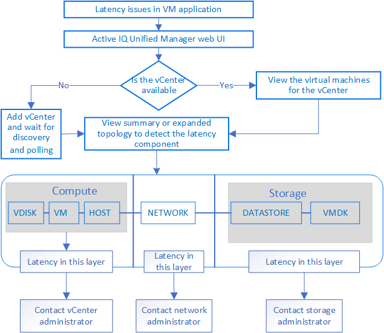

= Supervisión de la infraestructura virtual de VMware
:allow-uri-read: 
:icons: font
:imagesdir: ../media/

[role="lead"]
Active IQ Unified Manager proporciona visibilidad de las máquinas virtuales (VM) de su infraestructura virtual, y permite supervisar y solucionar los problemas de almacenamiento y rendimiento del entorno virtual. Es posible usar esta función para determinar cualquier problema de latencia en el entorno de almacenamiento o cuando se produjo un evento de rendimiento informado en vCenter Server.

Una infraestructura virtual típica puesta en marcha en ONTAP tiene diversos componentes que se distribuyen en las capas informática, de red y de almacenamiento. Cualquier retraso en el rendimiento de una aplicación de equipo virtual puede producirse debido a una combinación de latencias que deben afrontar los distintos componentes de las capas respectivas. Esta función es útil para administradores de almacenamiento y vCenter Server, así como para generalistas DE TI que necesitan analizar un problema de rendimiento en un entorno virtual y entender qué componente ha producido el problema.

Unified Manager presenta el subsistema subyacente de un entorno virtual en una vista topológica para determinar si se ha producido un problema de latencia en el nodo de computación, la red o el almacenamiento. La vista también destaca el objeto específico que provoca el desfase en el rendimiento a la hora de dar pasos correctivas y solucionar el problema subyacente.

Una infraestructura virtual implementada en el almacenamiento de ONTAP incluye los siguientes objetos:

* VCenter Server: Un plano de control centralizado para gestionar las máquinas virtuales de VMware, los hosts ESXi y todos los componentes relacionados en un entorno virtual. Para obtener más información sobre vCenter Server, consulte la documentación de VMware.
* Host: Un sistema físico o virtual que ejecuta ESXi, el software de virtualización de VMware y aloja la máquina virtual.
* Datastore: Los almacenes de datos son objetos de almacenamiento virtual conectados a los hosts ESXi. Los almacenes de datos son entidades de almacenamiento gestionables de ONTAP, como LUN o volúmenes, que se usan como repositorio para archivos del equipo virtual, como archivos de registro, scripts, archivos de configuración y discos virtuales. Se conectan a los hosts del entorno mediante una conexión DE red SAN o IP. Los almacenes de datos fuera de ONTAP que se asignan a vCenter Server no son compatibles o se muestran en Unified Manager.
* Máquina virtual: Una máquina virtual de VMware.
* Discos virtuales: Los discos virtuales en almacenes de datos que pertenecen a las máquinas virtuales que tienen una extensión como VMDK. Los datos de un disco virtual se almacenan en el VMDK correspondiente.
* VMDK: Un disco de máquina virtual del almacén de datos que proporciona espacio de almacenamiento para discos virtuales. Por cada disco virtual, hay un VMDK correspondiente.

Estos objetos se representan en una vista de topología de máquina virtual.

*Virtualización de VMware en ONTAP*

image::../media/vm-deployment.gif[puesta en marcha de máquinas virtuales]

*Flujo de trabajo del usuario*

El siguiente diagrama muestra un caso de uso típico de la vista de topología de la máquina virtual:

== Qué no se admite

* Los almacenes de datos que no son de ONTAP y se asignan a las instancias de vCenter Server no son compatibles con Unified Manager. Tampoco se admite cualquier máquina virtual con discos virtuales en esos almacenes de datos.
* No se admite un almacén de datos que abarca varios LUN.
* No se admiten los almacenes de datos que utilizan la traducción de direcciones de red (NAT) para asignar LIF de datos (punto final de acceso).
* No se admite una configuración con varias LIF con la misma dirección IP, es decir, varios almacenes de datos exportados con direcciones IP idénticas.
* Solo los volúmenes NAS Y SAN (iSCSI y FCP para VMFS) se admiten como almacenes de datos, pero no los volúmenes virtuales (vVoL).
* Solo se admiten discos virtuales iSCSI. No se admiten discos virtuales de los tipos NVMe y SATA.
* Las vistas no permiten generar informes para analizar el rendimiento de los distintos componentes.
* Para la configuración de recuperación ante desastres (DR) de las máquinas virtuales de almacenamiento (máquinas virtuales de almacenamiento), compatible con la única infraestructura virtual en Unified Manager, la configuración se debe cambiar manualmente en vCenter Server para dar lugar a los LUN activos en escenarios de conmutación y conmutación de estado. Sin intervención manual, no se puede acceder a sus almacenes de datos.

